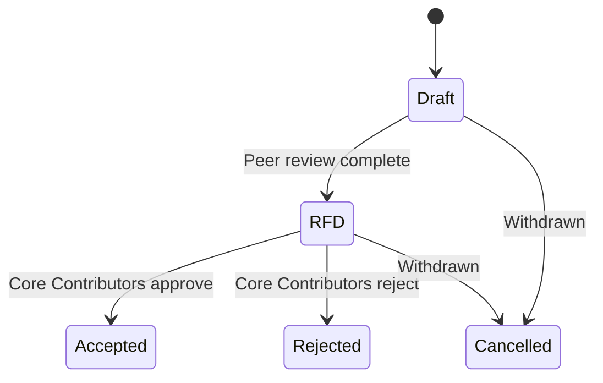

# AZIP Process

## Abstract

The AZIP (Aztec Improvement Proposal) process is how changes to the Aztec Network are proposed, reviewed, and recorded. AZIPs are version-controlled design documents maintained in a dedicated GitHub repository, which serves as the canonical record of all proposals. This document defines the AZIP lifecycle, required structure, categories, and editorial workflow.

## Rationale

AZIPs replace ad-hoc discussions with a structured, transparent process. By capturing proposals as version-controlled documents, AZIPs create a public record of motivations, design iterations, and community feedback for every proposed change. The framework is modeled on the [EIP](https://github.com/ethereum/EIPs/blob/master/EIPS/eip-1.md) and [BIP](https://bips.dev/) processes, adapted to Aztec’s governance needs.

## Scope

AZIPs are used to:

- Track progress while designing, building, and implementing new features
- Publicly communicate new features, designs, and create space for community input
- Propose new upgrades for approval & execution

All AZIPs must be grouped into one of the following categories:

1. **Core** - Core System AZIPs, including improvements to the protocol specifications for public, private, sequencer and prover components, and networking protocols.
2. **Economics** - Changes to the economic parameters of the protocol, including gas values, block rewards, fee splits, and the use of the protocol treasury. This includes requests to spend treasury funds or mint $AZTEC tokens. Compensation requests for governance roles (e.g. council members) are in scope. General grant requests are not entertained as part of this process.
3. **Standard** - Application layer AZIPs, e.g. defining standards for contracts written in Noir or a token standard etc. A separate standards process may be defined in the future.
4. **Informational** - Provide general guidelines or information to the Aztec community, but does not propose a new feature. Includes high level descriptions of the system, architecture, etc.

**What doesn't need an AZIP:** Changes that don't affect the protocol specification or standards do not require an AZIP. Examples include node software optimizations, new RPC endpoints, internal refactors, client UX improvements, or bug fixes that don't alter protocol behavior.

AZIPs that require onchain implementation are bundled into AZUPs by Core Contributors and submitted to Sequencers & Tokenholders for voting. See the [AZUP Process](azup-process.md) for more details.

### Process

Before entering the formal process, proposals start as posts in [GitHub Discussions](https://github.com/AztecProtocol/governance/discussions). Once an author opens a PR, the AZIP enters the formal lifecycle:

1. `Draft`: Author opens a pull request with a fully specified AZIP.
    - Steps:
        - Author opens a PR with the complete AZIP (all template fields completed, no TBDs)
        - An editor assigns the next available AZIP number and reviews the AZIP for formatting, language, markup, and basic completeness
        - The PR remains open for peer review. All feedback happens in PR comments
2. `RFD (Ready for Discussion)`: The AZIP has undergone peer review and is merged into the repository. Core Contributors review the AZIP for AZUP inclusion.
    - Steps:
        - While the PR is open, editors and authors socialize the AZIP with impacted stakeholders (see below). Authors update the AZIP based on feedback received
        - Peer review has been completed and documented in the PR, with provable engagement from impacted stakeholders
        - Security Considerations discussion deemed sufficient by the reviewers (for `Core`, `Standard`, and `Economics` AZIPs)
        - An editor reviews the PR and associated discussion to verify sufficient peer review
        - The editor merges the PR. The AZIP is now in the repository as the canonical record
3. `Accepted`: AZIP has been accepted by Core Contributors. `Core` and `Economics` AZIPs are implemented onchain via an AZUP. `Standard` and `Informational` AZIPs do not require onchain execution and are accepted through the same review process without an AZUP.
4. `Rejected`: Core Contributors have reviewed the AZIP and decided not to progress it for implementation. The rejection rationale must be documented by Core Contributors. A rejected AZIP remains in the repository as a permanent record and cannot be reopened. If the idea is revisited at a later date, a new AZIP must be submitted with a new number. The new proposal should reference the original AZIP and clearly describe what circumstances, context, or technical developments have changed since the original rejection that warrant reconsideration.
5. `Cancelled`: The AZIP author(s) or editors have withdrawn the proposed AZIP. An AZIP may be cancelled at any point after it has entered `Draft`. If the idea is pursued at a later date it is considered a new proposal.

### Impacted Stakeholders

Depending on the nature of the proposal, impacted stakeholders may include:

- **App Developers** — teams building applications on Aztec (e.g. wallets, DeFi protocols, gaming, payments)
- **Infrastructure Providers** — teams operating network infrastructure (e.g. RPC providers, oracles, indexers, block explorers, bridges)
- **Sequencers** — operators running sequencer nodes
- **Provers** — operators running proving infrastructure
- **Tokenholders** — governance participants who stake and vote

AZIPs govern the specification, not the implementation. If an existing implementation does not conform to the spec, it may be corrected without a new AZIP.

An AZIP's status does not enforce when development must begin. Work may start as early as Draft, but remains subject to change until the AZIP reaches `RFD` or `Accepted`.

## Content Requirements

AZIPs should be written in [markdown](https://github.com/adam-p/markdown-here/wiki/Markdown-Cheatsheet) format. All AZIPs must follow the official [AZIP Template](./AZIPs/template.md).

Each AZIP should have the following parts:

- **Preamble:**
    - Headers containing metadata about the AZIP, including the AZIP number, a short descriptive title (limited to a maximum of 80 characters), a description (limited to a maximum of 140 characters), and the author details. The title and description should not include the AZIP number. See below for details.
- **Abstract:**
    - Abstract is a multi-sentence (short paragraph) technical summary. This should be a very terse and human-readable version of the specification section. Someone should be able to read only the abstract to get the gist of what this specification does.
- **Motivation:**
    - A motivation section is required for all AZIPs. It should clearly explain why the existing protocol specification is inadequate to address the problem that the AZIP solves.
- **Specification** (required for `Core` and `Standard` AZIPs):
    - The technical specification should describe the syntax and semantics of any new feature. The specification should be detailed enough to allow competing, interoperable implementations.
- **Rationale:**
    - The rationale fleshes out the specification by describing what motivated the design and why particular design decisions were made. It should describe alternate designs that were considered and related work, e.g. how the feature is supported in other languages. The rationale should discuss important objections or concerns raised during discussion around the AZIP.
- **Backwards Compatibility:**
    - All AZIPs must include a Backwards Compatibility section. If the proposal introduces backwards incompatibilities, this section must describe them, their consequences, and how the author proposes to address them. If no incompatibilities exist, the section must still be present and explicitly state that.
- **Test Cases** (if applicable):
    - Tests should either be inlined in the AZIP as data (such as input/expected output pairs), or included in `../assets/azip-###/<filename>`.
- **Reference Implementation** (optional)
    - An optional section that contains a reference/example implementation that people can use to assist in understanding or implementing this specification. This section may be omitted for all AZIPs.
- **Economics Considerations** (required for `Economics` AZIPs):
    - All proposals that change economic parameters or spend protocol funds should include a full economic analysis of the long-term effects on sequencing and proving the network for operators. Proposals that request funds from the treasury must clearly detail where the funds will go and how they will be spent. Any funds going to smart contracts must meet the Security Considerations below.
- **Security Considerations** (required for `Core`, `Standard`, and `Economics` AZIPs):
    - All `Core`, `Standard`, and `Economics` AZIPs must contain a section that discusses the security implications/considerations relevant to the proposed change. Include information that might be important for security discussions, surfaces risks and can be used throughout the life-cycle of the proposal. E.g. include security-relevant design decisions, concerns, important discussions, implementation-specific guidance and pitfalls, an outline of threats and risks and how they are being addressed. AZIP submissions missing the “Security Considerations” section will be rejected. An AZIP cannot proceed to status `RFD` without a Security Considerations discussion deemed sufficient by the reviewers.
- **Copyright Waiver:**
    - All AZIPs must be in the public domain. The copyright waiver MUST link to the license file and use the following wording: `Copyright and related rights waived via [CC0](/LICENSE).`

## AZIP Authors

Throughout the process, AZIP author(s) are responsible for building community consensus, collecting and implementing technical feedback, and interfacing with AZIP editors. 

### Transferring AZIP Ownership

Transferring ownership of an AZIP to a new champion may occasionally be necessary. In general, the original author should remain a co-author, but this is at the discretion of the original author. Appropriate reasons for a transfer include the original author no longer having the time or interest to maintain the AZIP, or being unreachable and unable to respond to feedback or change requests. Disagreement with the current direction of an AZIP is not, by itself, a sufficient reason for a transfer; in such cases, contributors are encouraged to seek consensus or, if that is not possible, submit a competing AZIP.

Contributors who wish to assume ownership of an AZIP should submit a request addressed to both the current author and an AZIP editor. If the original author does not respond within a reasonable timeframe, the AZIP editor may make a unilateral decision regarding the transfer, with the understanding that such decisions can be revisited if circumstances change.

## AZIP Editors

AZIP editors verify that proposals meet the criteria required to progress through the AZIP process. Authors drive their own proposals through the process; editors are administrators, not decision-makers. AZIP editors are currently designated by the Aztec Foundation and include members of the Aztec Foundation and Aztec Labs. 

The current AZIP editors are:

- [Josh Crites](https://github.com/critesjosh) [josh@aztec-labs.com](mailto:josh@aztec-labs.com)

Many AZIPs are written and maintained by developers with write access to the Aztec codebase. The AZIP editors continuously monitor AZIP changes, and correct any structure, grammar, spelling, or markup mistakes.

AZIP editors are *administrators*, not *decision-makers*. They are required to raise AZIPs up to Core Contributors regardless of their subjective views on the contents of those proposals. Their role is to ensure that each AZIP is properly formatted, discussed, and meets the criteria at each stage, but not to act as a subjective gatekeeper. If an AZIP does not meet the requirements, the editor will comment on the PR requesting changes with specific instructions.

See the [Governance Manual](governance-manual.md) for more on Aztec governance.

## History

This document was derived heavily from [Ethereums EIP-001](https://eips.ethereum.org/EIPS/eip-1), which in turn was derived from [Bitcoin's BIP-0001](https://github.com/bitcoin/bips) written by Amir Taaki which in turn was derived from [Python's PEP-0001](https://peps.python.org/). In many places text was simply copied and modified. Do not bother the authors of these ancestor works with technical questions specific to Aztec or the AZIP. Please direct all comments to the AZIP editors.

## Copyright

Copyright and related rights waived via CC0.

---

## Resources

[AZIP Template](./AZIPs/template.md)
