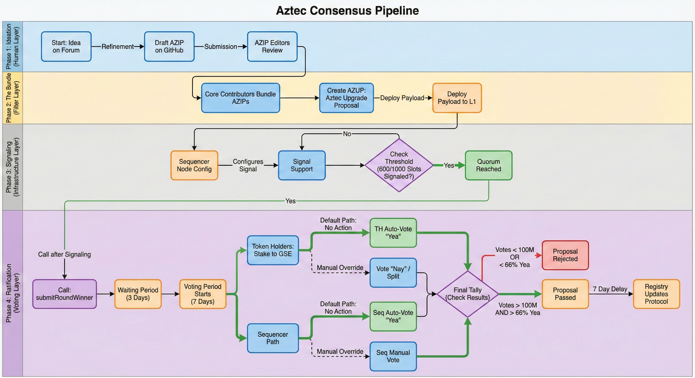

# Aztec Governance Manual

# Background

The Aztec Network is a fully decentralised L2 on top of Ethereum. A decentralized network must be made up of a permissionless network of operators who run the network and decide on upgrades. Aztec is run by a decentralized network of node operators who propose and attest to transactions. Rollup proofs on Aztec are also run by a decentralized prover network that can permissionlessly submit proofs and participate in block rewards. Finally, the Aztec network is governed by the sequencers, who propose, signal, vote, and execute network upgrades.

The purpose of Aztec governance is to remove control over the network from the hands of any single entity or individual. Decentralized sequencing, proving, and governance are hard‑coded into the base protocol so that no central actor can unilaterally change the rules, censor transactions, or appropriate user value. Multi-stakeholder governance reduces platform risk, improves capture‑resistance, and gives builders and users credible assurances that the network will not turn against them as it grows. By distributing upgrade authority across sequencers and tokenholders and grounding all decisions in open, transparent processes (AZIPs and AZUPs), Aztec aims to align long‑term protocol stewardship with the people who depend on it, while still enabling efficient, scalable decision‑making about upgrades, parameters, and resources.

# Governance Components

- **AZIPs** – Off‑chain, version‑controlled design documents that specify proposed changes to Aztec’s protocols, standards, or governance processes, serving as the canonical record of what should change and why.
- **AZUPs** – Onchain upgrade bundles that package one or more AZIPs, plus their associated payloads, into a concrete proposal for execution on the Aztec Network.
- **Payloads** – Series of onchain commands that execute against protocol contracts (or update contract references) detailed by an approved AZUP.
- **Signalling** – The process by which sequencers express support for an AZUP’s payload onchain; once a payload receives signals in at least 600 of 1,000 eligible block slots, it is promoted to a formal onchain proposal.
- **Onchain Proposals** – Governance objects created once a payload meets sequencer signaling thresholds, defining a specific upgrade that tokenholders can vote to accept or reject.
- **Voting** – The onchain decision process in which eligible tokenholders lock tokens to cast “for” or “against” votes on proposals, with quorum and supermajority requirements determining whether an upgrade is authorized to execute.

# Governance Bodies

## Sequencers

Sequencers in Aztec are block producers and core governance actors. By running a sequencer node and staking into a rollup, they both build blocks and help steer protocol upgrades. 

Before AZUPs are presented to tokenholders for voting, they must gather enough support from sequencers. Sequencers vote on the support of AZUPs via onchain signalling. 600‑of‑1000 signals are needed from sequencers to advance an AZUP’s payload into the voting phase. This means sequencers collectively decide which AZUPs reach the formal voting stage.

A sequencer’s staked capital is its voting power. By default, their stake is delegated through the Governance Staking Escrow (GSE) to the rollup contract, which automatically votes “yea” on AZUPs that came through the sequencer signaling path. This means sequencers passively support all AZUPs unless they explicitly delegate away from the rollup to an address they control and vote directly via the GSE.

Sequencers are expected to monitor proposals from signaling through execution and upgrade their node software in sync with approved changes so that the network’s block production and protocol logic remain consistent.

## Core Contributors

The Core Contributors are a representative governance body that serves as the primary steward of the Aztec Network, providing a structured locus for review and coordination around proposed changes. Core Contributors are responsible for reviewing AZIPs, evaluating the implications of their design and implementations, and deciding which proposals should advance onchain to sequencers for signalling and to tokenholders for voting. Core Contributors are responsible for ensuring that AZIPs preserve coherence, security, and alignment with the network’s long‑term roadmap prior to network‑wide ratification.

Given the number and diversity of contributors within the Aztec Network, the composition of the Core Contributors ensures proper representation of multiple stakeholder groups:

- **Client Teams** → teams responsible for developing Aztec clients (up to two representatives per team).
- **Founders** → two perpetual seats reserved for original Aztec Labs founders Joe Andrews and Zac Williamson.
- **Sequencers** → representatives of the active sequencers securing and operating the Aztec Network.
- **Ecosystem** → representatives of dApp developers and broader ecosystem partners.
- **Noir** → representatives of the Noir language and its developer community.

The representatives of Ecosystem, Noir and Sequencers can be changed via an AZIP proposal put forward by anyone.

Currently, the Core Contributors are composed of the following representatives:

- Client teams → Aztec Labs (rep: TBD)
- Ecosystem → Alejo Amiras
- Noir → Savio Sou
- Sequencers → Koen van Marrewijk
- Founders → Joe Andrews and Zac Williamson

## Tokenholders

Tokenholders play a direct role in Aztec governance by staking their tokens and participating in onchain votes. Any tokenholder may participate in governance votes by connecting their wallet to the governance dashboard, staking into the Token Vault, and locking tokens for at least 15 days to ensure proposals can be executed before they exit. 

Once a proposal is created by sequencers, all eligible Token Vault holders can vote during a 7‑day voting window, following a fixed timeline that includes an initial waiting period, a voting period, an execution delay, and a final grace period for execution. For a proposal to pass, at least 100 million tokens must participate in the vote, and a minimum of 66% of the votes cast must be in favor.

Aztec Labs and Aztec Foundation teams, as well as investors, are excluded from staking and governance for the first 12 months (including the TGE vote), with their tokens locked for 1 year and then vesting over the following 2 years. 

# Governance Process

## AZIPs

AZIPs (AZtec Improvement Proposal) are a tool that can be used by anyone to propose informal changes, technical changes or to propose standards that can be used within the Aztec Network. AZIPs are version-controlled design documents that detail the motivation, technical specification, rationale, implementation path, and impact evaluation of proposed protocol-level, system-level, and application-level changes for the Aztec network, ranging from high-level informational context to core infrastructure updates and application standards. AZIPs are used to:

- Track progress while designing, building, and implementing new features
- Publicly communicate new features, designs, and create space for community input
- Propose new upgrades for approval & execution

### **Process**

The current AZIP process is defined by the [AZIP Process](azip-process.md).

## AZUP

AZUPs (AZtec Upgrade Proposals) bundle the implementations of one or more AZIPs that Core Contributors have approved for inclusion in the Aztec Network. Once an AZUP is scheduled, its onchain payload is deployed to mainnet, where it is submitted to sequencers for signalling.

Once sequencers have signaled support for the deployed payload, anyone can promote it to a formal onchain governance proposal. After a 3-day review delay, the proposal enters a 7-day voting window where staked tokenholders vote “yea” or “nay”. If quorum, supermajority, and participation thresholds are met the proposal passes. After a final 7‑day execution delay the proposal can then be executed by anyone, implementing the AZUP onchain. 

### Process

The current AZUP process is defined by the [AZUP Process](azup-process.md).

