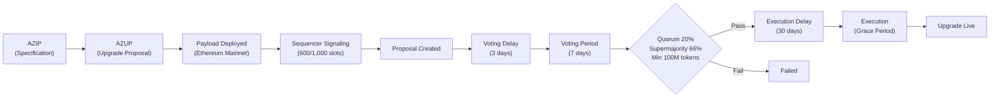

# Aztec Governance Manual

# Background

The Aztec Network is a fully decentralized L2 on top of Ethereum, run by a permissionless network of sequencers who propose and attest to transactions, and provers who submit rollup proofs. Sequencers also serve as core governance actors, proposing, signaling, voting on, and executing network upgrades.

The purpose of Aztec governance is to remove control over the network from the hands of any single entity or individual. Decentralized sequencing, proving, and governance are hard-coded into the base protocol so that no central actor can unilaterally change the rules, censor transactions, or appropriate user value. Multi-stakeholder governance reduces platform risk, improves capture-resistance, and gives builders and users credible assurances that the network will not turn against them as it grows. By distributing upgrade authority across sequencers and tokenholders and grounding all decisions in open, transparent processes (AZIPs and AZUPs), Aztec aims to align long-term protocol stewardship with the people who depend on it, while still enabling efficient, scalable decision-making about upgrades, parameters, and resources.

# Governance Components

- **AZIPs** – Offchain, version-controlled design documents that specify proposed changes to Aztec’s protocols, standards, or governance processes, serving as the canonical record of what should change and why.
- **AZUPs** – Onchain upgrade bundles that package one or more AZIPs, plus their associated payload, into a concrete proposal for execution on the Aztec Network.
- **Payloads** – Series of onchain commands that execute against protocol contracts (or update contract references) detailed by an approved AZUP.
- **Signaling** – The process by which sequencers express support for an AZUP’s payload onchain; once a payload receives signals in at least 600 of 1,000 eligible slots, it is promoted to a formal onchain proposal.
- **Onchain Proposals** – Governance objects created once a payload meets sequencer signaling thresholds, defining a specific upgrade that tokenholders can vote to accept or reject.
- **Voting** – The onchain decision process in which eligible tokenholders lock tokens to cast “yea” or “nay” votes on proposals, with quorum and supermajority requirements determining whether an upgrade is authorized to execute.

# Governance Bodies

## Sequencers

Sequencers in Aztec are block producers and core governance actors. By running a sequencer node and staking into a rollup, they both build blocks and help steer protocol upgrades. 

Before AZUPs are presented to tokenholders for voting, they must gather enough support from sequencers. Sequencers vote on the support of AZUPs via onchain signaling. 600 of 1,000 signals are needed from sequencers to advance an AZUP’s payload into the voting phase. This means sequencers collectively decide which AZUPs reach the formal voting stage.

A sequencer’s staked capital is its voting power. By default, their stake is delegated through the Governance Staking Escrow (GSE) to the rollup contract, which automatically votes “yea” on AZUPs that came through the sequencer signaling path. This means sequencers passively support all AZUPs unless they explicitly delegate away from the rollup to an address they control and vote directly via the GSE.

Sequencers are expected to monitor proposals from signaling through execution and upgrade their node software in sync with approved changes so that the network’s block production and protocol logic remain consistent.

## Core Contributors

Core Contributors are individuals who actively and meaningfully contribute to the development, security, or governance of the Aztec Network. Participation is informal and merit-based — there is no fixed list or formal appointment process. Core Contributors coordinate around reviewing AZIPs, evaluating the implications of their design and implementations, and deciding which proposals should advance onchain to sequencers for signaling and to tokenholders for voting. They help ensure that AZIPs preserve coherence, security, and alignment with the network’s long-term roadmap prior to network-wide ratification.

### Core Contributor Weekly

The Core Contributor Weekly is a call held once a week to discuss various initiatives involving the Aztec Network. The facilitator creates a GitHub Issue for each weekly call as the agenda. Anyone can propose agenda items by commenting on the issue. Agendas can be found on the [Issues tab](https://github.com/AztecProtocol/governance/issues).

If you would like to join these calls as an observer please contact the current facilitator.

*Facilitator* → [Koen van Marrewijk](https://github.com/koenmtb1) (Mar ‘26) [koen@aztec.foundation](mailto:koen@aztec.foundation)

## Tokenholders

Tokenholders play a direct role in Aztec governance by staking their tokens and participating in onchain votes. Any tokenholder may participate in governance votes by connecting their wallet to the governance dashboard, depositing into the Governance contract, and locking tokens for at least 38 days to ensure proposals can be executed before they exit. 

Once a proposal is created by sequencers, all eligible stakers can vote during a 7-day voting window, following a fixed timeline that includes an initial waiting period, a voting period, an execution delay, and a final grace period for execution. For a proposal to pass, at least 20% of the total voting power in governance must participate, at least 66% of votes cast must be yea, and at least 100,000,000 tokens must be deposited in governance.

Aztec Labs and Aztec Foundation teams, as well as investors, are excluded from staking and governance for the first 12 months (including the TGE vote), with their tokens locked for 1 year and then vesting over the following 2 years. 

# Governance Process

## AZIPs

AZIPs (AZtec Improvement Proposals) are version-controlled design documents that anyone can use to propose changes to the Aztec Network.

### Process

The current AZIP process is defined by the [AZIP Process](azip-process.md).

## AZUP

AZUPs (AZtec Upgrade Proposals) bundle the implementations of one or more AZIPs that Core Contributors have approved for inclusion in the Aztec Network. Once an AZUP is scheduled, its onchain payload is deployed to mainnet, where it is submitted to sequencers for signaling.

Once sequencers have signaled support for the deployed payload, anyone can promote it to a formal onchain governance proposal. After a 3-day review delay, the proposal enters a 7-day voting window where staked tokenholders vote “yea” or “nay”. If quorum, supermajority, and participation thresholds are met, the proposal passes. After a final 30-day execution delay, the proposal can then be executed by anyone within the grace period (`getGracePeriod()` in `Governance.sol`), implementing the AZUP onchain. If not executed within the grace period, the proposal expires.

### Process

The current AZUP process is defined by the [AZUP Process](azup-process.md).

